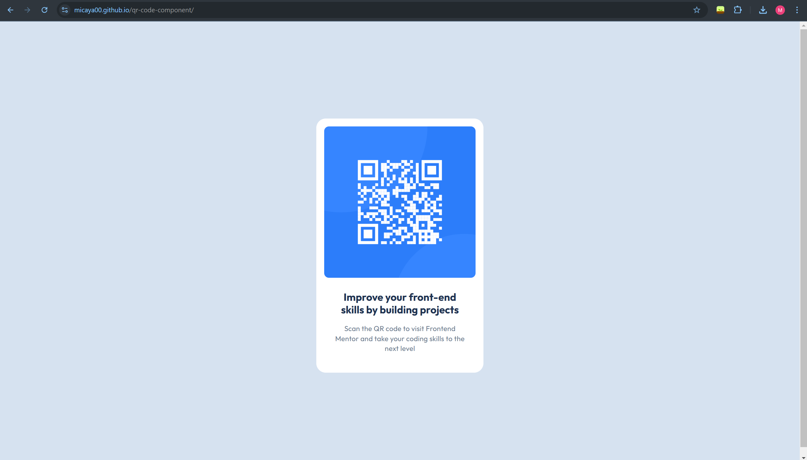

# Frontend Mentor - QR code component solution

This is a solution to the [QR code component challenge on Frontend Mentor](https://www.frontendmentor.io/challenges/qr-code-component-iux_sIO_H). Frontend Mentor challenges help you improve your coding skills by building realistic projects. 

## Table of contents

- [Overview](#overview)
  - [Screenshot](#screenshot)
  - [Links](#links)
- [My process](#my-process)
  - [Built with](#built-with)
  - [What I learned](#what-i-learned)
  - [Continued development](#continued-development)
  - [Useful resources](#useful-resources)
- [Author](#author)

## Overview

### Screenshot



### Links

- Solution URL: [Add solution URL here](https://your-solution-url.com)
- Live Site URL: Github.io (https://your-live-site-url.com)

## My process
- I first downloaded the starter files and created a local repository with it. 
- I created an empty repository on my Github and connected it to my local repository.
- I added the Google Font, Outfit on the header and finished the rest of the html.
- With the css, I first aligned the div to the center using Flexbox. 
- I styled the rest of the HTML elements while using the Figma file for the details.
- I rechecked the similarity and added the small details. 

### Built with

- HTML5 markup
- CSS custom properties
- Flexbox

### What I learned

- Using link tag to add a font from Google Font
```html
  <link rel="preconnect" href="https://fonts.googleapis.com">
  <link rel="preconnect" href="https://fonts.gstatic.com" crossorigin>
  <link href="https://fonts.googleapis.com/css2?family=Outfit:wght@400;700&display=swap" rel="stylesheet">

```

- Using Flexbox to center align div horizontally and vertically
```css
body {
    display: flex;
    justify-content: center;
    align-items: center;
    flex-direction: column;
    align-content: center;
}
```

-Using Box Shadow and its 4 values
```css
div {
    box-shadow: 0 1px 5px hsl(212, 45%, 89%);
}
```

### Continued development

I'm gonna keep on working on HTML, CSS, and Flexbox. I'll also do the other challenges about landing pages and with JavaScript functions.

### Useful resources

- Getting the Most Out of Variable Fonts on Google Fonts (https://css-tricks.com/getting-the-most-out-of-variable-fonts-on-google-fonts/#aa-using-variable-fonts) - This helped me in learning about Variable fonts and how to use them on my files.
- CSS Flexbox Layout Guide (https://css-tricks.com/snippets/css/a-guide-to-flexbox/) - This is an article that taught me Flexbox.
- box-shadow (https://css-tricks.com/almanac/properties/b/box-shadow/) - This article taught me how to use box-shadow and its 4 values.
- Git and GitHub - 0 Experience to Professional in 1 Tutorial (Part 1) (https://www.youtube.com/watch?v=hrTQipWp6co&t=0s) - This video by SuperSimpleDev helped me understand Git and use it.
- Git and GitHub - 0 Experience to Professional in 1 Tutorial (Part 2)(https://www.youtube.com/watch?v=1ibmWyt8hfw&t=710s) - This is the second part of the video. This video specifically taught about Github and how to connect them to your local repository.

## Author

- Website - Micaya Blanco (https://github.com/micaya00)
- Frontend Mentor - micaya00 (https://www.frontendmentor.io/profile/micaya00)